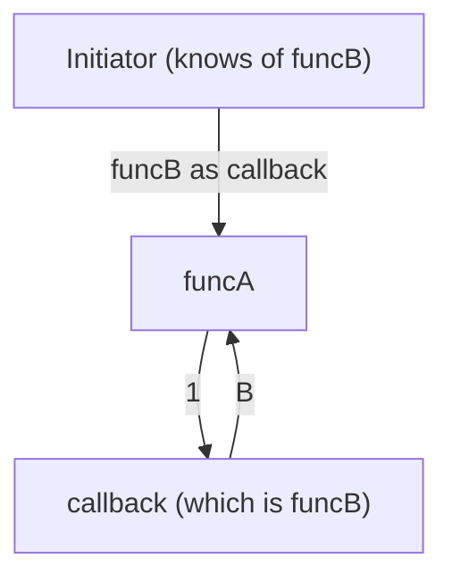
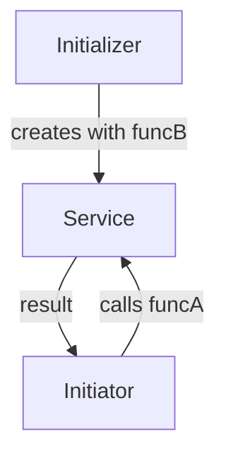
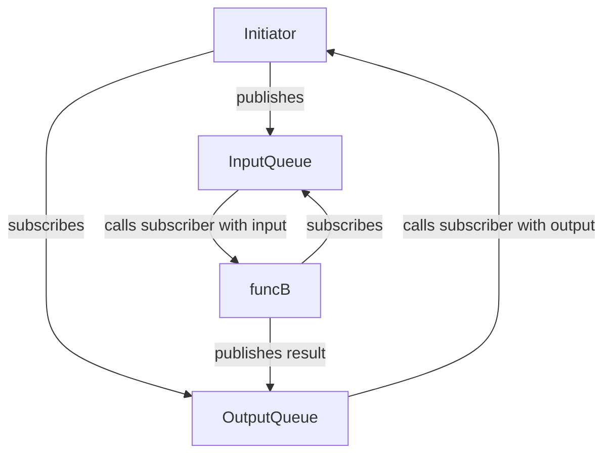

## Version A (callback)
The function A defines its expectation in form of a callback-parameter which defines
the signature of the function to call.

```typescript
function funcA(callback: (paramA: number) => string) {
    console.log(callback(1));
}

funcA(function (paramA: number) {
    return "B" + paramA;
}); // console: "B1"
funcA(function (paramA: number) {
    return "C" + paramA;
}); // console: "C1"
```

## Version B (DI):
The function A has access to a variable which is of type IFuncB. This interface defines 
the signature of the function to call.

```typescript
interface IFuncB {
    funcB(paramA: number): string;
}

class A {
    private funcB: IFuncB;

    constructor(private func: IFuncB) {
        this.funcB = func;
    }

    funcA() {
        console.log(this.funcB(1));
    }
}

(new A(function (paramA: number) {
    return "B" + paramA
})).funcA(); // console: "B1"
(new A(function (paramA: number) {
    return "C" + paramA
})).funcA(); // console: "C1"
```

## Version C (Pub/Sub)

